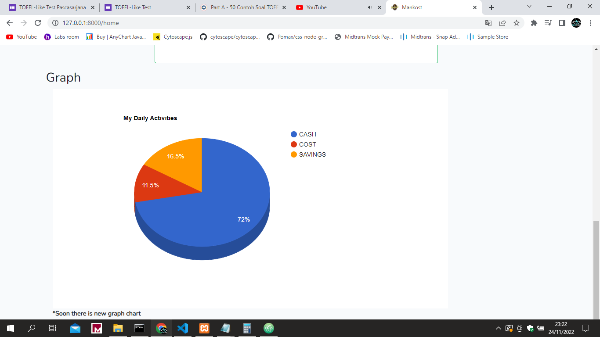

## Update 

## About 

MANKOST, simple monitoring pemasukan dan pengeluaran Anda secara otomatis. Project ini dibuat di saat saya untuk memanage keuangan serta gabut 

## Bagaimana cara bekerja?

Simple, pengeluaran tidak boleh lebih besar, pastikan saldo dan tabungan yang Anda sesuaikan jangan sampai lebih boros!

> **_NOTE:_** Jika Anda menemukan cacat logika silahkan bisa membuat issue. Ini berdasarkan rumusan saya pribadi

## Fitur

- Filter date (hari ini)
- Simple design 
- Target nabung 
- Otomatis count
- Otomasi count balance
- Export csv dan pdf
- Delete massal cost dan cash
- Delete massal menyeluruh semua data
- Otomatis get pengeluaran terbsesar
- Otomatis get pemasukan terbsesar
- Sangat ringan bisa digunakan di laptop kentang
- Graph interface (Coming soon)
- Tips nabung (Coming soon)
- Filter output dan pencarian (Coming soon)

NB : *Mankost sudah bisa digunakan untuk keperluan standar, seperti penghitungan, pengurangan dan lainya Anda dapat menikmati mankost ini

## Installisasi

- Run composer install && update
- Run "cp .env.example .env" (linux)
- Run "copy .env.example .env" (windows)
- Run "php artisan key:generate"
- Edit .env samakan databse Anda 

Database :

> DB_CONNECTION=mysql
> 
> DB_HOST=127.0.0.1
> 
> DB_PORT=3306
> 
> DB_DATABASE=your database
> 
> DB_USERNAME=your username
> 
> DB_PASSWORD=your password

- Run "php artisan migrate"
- Run "php artisan db:seed"
- Run "php artisan serve"

## Note 

Halaman register saya disable, untuk itu Anda dapat melakukan database seeder terlebih dahulu
